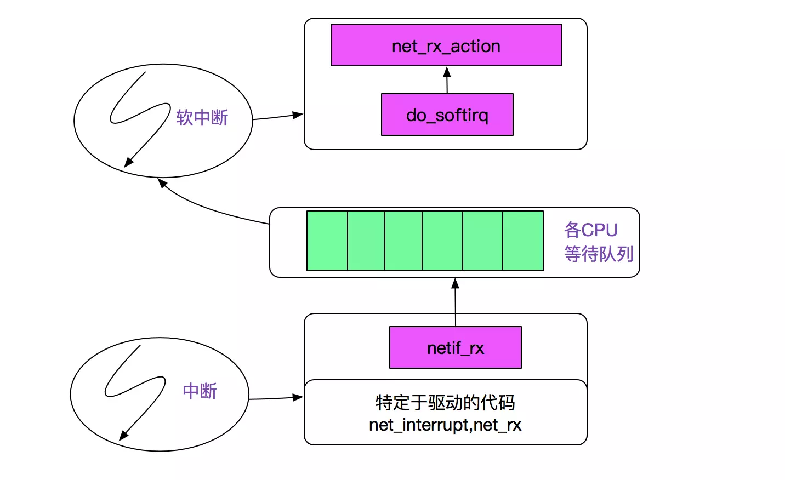

# epoll

问题：     
    1. epoll时间的注册流程 看epoll_ctl      
    2. epoll唤醒机制（linux-2.6.32.20/fs/eventpoll.c 下面的 ep_poll_callback 函数，该函数时注册在epoll文件的回调函数，他是触发是由网络中断出发的）
    3. epoll的连接过期怎么实现的，这个有一个红黑树的应用
    4. epoll的是事件处理流程
    5. 
    
```c  

struct eventpoll {
	/* Protect the this structure access */
	spinlock_t lock;

	/*
	 * This mutex is used to ensure that files are not removed
	 * while epoll is using them. This is held during the event
	 * collection loop, the file cleanup path, the epoll file exit
	 * code and the ctl operations.
	 */
	struct mutex mtx;

	/* Wait queue used by sys_epoll_wait() */
	wait_queue_head_t wq;

    // 就绪事件列表===============================这个就是我想要解决的问题，它是怎么过来的，从哪里过来，用什么方式过来======================================
	/* Wait queue used by file->poll() */
	wait_queue_head_t poll_wait;

	/* List of ready file descriptors */
	struct list_head rdllist;

	/* RB tree root used to store monitored fd structs */
	struct rb_root rbr;

	/*
	 * This is a single linked list that chains all the "struct epitem" that
	 * happened while transfering ready events to userspace w/out
	 * holding ->lock.
	 */
	struct epitem *ovflist;

	/* The user that created the eventpoll descriptor */
	struct user_struct *user;
};

/* Wait structure used by the poll hooks */
struct eppoll_entry {
	/* List header used to link this structure to the "struct epitem" */
	struct list_head llink;

	/* The "base" pointer is set to the container "struct epitem" */
	struct epitem *base;

	/*
	 * Wait queue item that will be linked to the target file wait
	 * queue head.
	 */
	wait_queue_t wait;

	/* The wait queue head that linked the "wait" wait queue item */
	wait_queue_head_t *whead;
};

```


epoll 核心函数：epoll_create、epoll_ctl、epoll_wait

# epoll_create

源码
```c 
// 定义系统调用 epoll_create函数，这个可以看出来传进来的size压根没有用
SYSCALL_DEFINE1(epoll_create, int, size)
{
    if (size <= 0)
        return -EINVAL;
    // 而它的调用为下面的调用实现
    return sys_epoll_create1(0);
}

/*
 * Open an eventpoll file descriptor.
 * 打开一个eventpoll文件描述符
 */
SYSCALL_DEFINE1(epoll_create1, int, flags)
{
	int error;
	struct eventpoll *ep = NULL;

	/* Check the EPOLL_* constant for consistency.  */
	BUILD_BUG_ON(EPOLL_CLOEXEC != O_CLOEXEC);

	if (flags & ~EPOLL_CLOEXEC)
		return -EINVAL;
	/*
	 * Create the internal data structure ("struct eventpoll").
     * 创建一个epoll event事件
	 */
	error = ep_alloc(&ep);
	if (error < 0)
		return error;
	/*
	 * Creates all the items needed to setup an eventpoll file. That is,
	 * a file structure and a free file descriptor.
	 */
	error = anon_inode_getfd("[eventpoll]", &eventpoll_fops, ep,
				 flags & O_CLOEXEC);
	if (error < 0)
		ep_free(ep);

	return error;
}
// 创建一个epollevent结构
static int ep_alloc(struct eventpoll **pep)
{
	int error;
	struct user_struct *user;
	struct eventpoll *ep;

	user = get_current_user();
	error = -ENOMEM;
	ep = kzalloc(sizeof(*ep), GFP_KERNEL);
	if (unlikely(!ep))
		goto free_uid;

	spin_lock_init(&ep->lock);
	mutex_init(&ep->mtx);
	init_waitqueue_head(&ep->wq);
	init_waitqueue_head(&ep->poll_wait);
	INIT_LIST_HEAD(&ep->rdllist);
	ep->rbr = RB_ROOT;
	ep->ovflist = EP_UNACTIVE_PTR;
	ep->user = user;

	*pep = ep;

	return 0;

free_uid:
	free_uid(user);
	return error;
}

// 见epollevent文件描述符加入到文件描述符槽中
int anon_inode_getfd(const char *name, const struct file_operations *fops,
		     void *priv, int flags)
{
	int error, fd;
	struct file *file;

	error = get_unused_fd_flags(flags);
	if (error < 0)
		return error;
	fd = error;

	file = anon_inode_getfile(name, fops, priv, flags);
	if (IS_ERR(file)) {
		error = PTR_ERR(file);
		goto err_put_unused_fd;
	}
	fd_install(fd, file);

	return fd;

err_put_unused_fd:
	put_unused_fd(fd);
	return error;
}


```


# epoll_ctl

源码
```c  
/*
 * 向epoll对象中添加、修改、删除*感兴趣*的事件
 * The following function implements the controller interface for
 * the eventpoll file that enables the insertion/removal/change of
 * file descriptors inside the interest set.
 */
SYSCALL_DEFINE4(epoll_ctl, int, epfd, int, op, int, fd,
		struct epoll_event __user *, event)
{
	int error;
	struct file *file, *tfile;
	struct eventpoll *ep;
	struct epitem *epi;
	struct epoll_event epds;

	error = -EFAULT;
	if (ep_op_has_event(op) &&
	    copy_from_user(&epds, event, sizeof(struct epoll_event)))
		goto error_return;

	/* Get the "struct file *" for the eventpoll file */
	error = -EBADF;
	file = fget(epfd);
	if (!file)
		goto error_return;

	/* Get the "struct file *" for the target file */
	tfile = fget(fd);
	if (!tfile)
		goto error_fput;

	/* The target file descriptor must support poll */
	error = -EPERM;
	if (!tfile->f_op || !tfile->f_op->poll)
		goto error_tgt_fput;

	/*
	 * We have to check that the file structure underneath the file descriptor
	 * the user passed to us _is_ an eventpoll file. And also we do not permit
	 * adding an epoll file descriptor inside itself.
	 */
	error = -EINVAL;
	if (file == tfile || !is_file_epoll(file))
		goto error_tgt_fput;

	/*
	 * At this point it is safe to assume that the "private_data" contains
	 * our own data structure.
	 */
	ep = file->private_data;

	mutex_lock(&ep->mtx);

	/*
	 * Try to lookup the file inside our RB tree, Since we grabbed "mtx"
	 * above, we can be sure to be able to use the item looked up by
	 * ep_find() till we release the mutex.
	 */
	epi = ep_find(ep, tfile, fd);

	error = -EINVAL;
	switch (op) {
	case EPOLL_CTL_ADD:
		if (!epi) {
			epds.events |= POLLERR | POLLHUP;
// =================================================事件注册关键点===========================================
// 
			error = ep_insert(ep, &epds, tfile, fd);
		} else
			error = -EEXIST;
		break;
	case EPOLL_CTL_DEL:
		if (epi)
			error = ep_remove(ep, epi);
		else
			error = -ENOENT;
		break;
	case EPOLL_CTL_MOD:
		if (epi) {
			epds.events |= POLLERR | POLLHUP;
			error = ep_modify(ep, epi, &epds);
		} else
			error = -ENOENT;
		break;
	}
	mutex_unlock(&ep->mtx);

error_tgt_fput:
	fput(tfile);
error_fput:
	fput(file);
error_return:

	return error;
}


================================================== ep_insert ========================================================================================
/* 
epoll_ctl的添加事件操作，
SYSCALL_DEFINE4(epoll_ctl, int, epfd, int, op, int, fd,
		struct epoll_event __user *, event)
{   // ...
    error = ep_insert(ep, &epds, tfile, fd);
    // ...
}
*/
// 注册事件的函数，不过它还是调用的跟底层的tfile->f_op->poll(tfile, &epq.pt)
static int ep_insert(struct eventpoll *ep, struct epoll_event *event,
		     struct file *tfile, int fd)
{
	int error, revents, pwake = 0;
	unsigned long flags;
	struct epitem *epi;
	struct ep_pqueue epq;

	if (unlikely(atomic_read(&ep->user->epoll_watches) >=
		     max_user_watches))
		return -ENOSPC;
	if (!(epi = kmem_cache_alloc(epi_cache, GFP_KERNEL)))
		return -ENOMEM;

	/* Item initialization follow here ... */
    // 先来初始化
	INIT_LIST_HEAD(&epi->rdllink);
	INIT_LIST_HEAD(&epi->fllink);
	INIT_LIST_HEAD(&epi->pwqlist);
	epi->ep = ep;
	ep_set_ffd(&epi->ffd, tfile, fd);
	epi->event = *event;
	epi->nwait = 0;
	epi->next = EP_UNACTIVE_PTR;

	/* Initialize the poll table using the queue callback */
	epq.epi = epi;
    // 初始化回调函数=============================================================================================
    // static inline void init_poll_funcptr(poll_table *pt, poll_queue_proc qproc)
    //   {
    //   	pt->qproc = qproc;
    //   	pt->key   = ~0UL; /* all events enabled */
    //   }
	init_poll_funcptr(&epq.pt, ep_ptable_queue_proc);

	/*
     * 将该项附加到轮询挂钩并获取当前事件位
     * 就是注册回调事件，
	 * Attach the item to the poll hooks and get current event bits.
	 * We can safely use the file* here because its usage count has
	 * been increased by the caller of this function. Note that after
	 * this operation completes, the poll callback can start hitting
	 * the new item.
	 */
	revents = tfile->f_op->poll(tfile, &epq.pt);

	/*
	 * We have to check if something went wrong during the poll wait queue
	 * install process. Namely an allocation for a wait queue failed due
	 * high memory pressure.
	 */
	error = -ENOMEM;
	if (epi->nwait < 0)
		goto error_unregister;

    // 添加节点到双向链表
	/* Add the current item to the list of active epoll hook for this file */
	spin_lock(&tfile->f_lock);
	list_add_tail(&epi->fllink, &tfile->f_ep_links);
	spin_unlock(&tfile->f_lock);

	/*
     * 将当前节点插入红黑树中，这个应该有互斥锁的保护
	 * Add the current item to the RB tree. All RB tree operations are
	 * protected by "mtx", and ep_insert() is called with "mtx" held.
	 */
	ep_rbtree_insert(ep, epi);

	/* We have to drop the new item inside our item list to keep track of it */
	spin_lock_irqsave(&ep->lock, flags);

	/* If the file is already "ready" we drop it inside the ready list */
	if ((revents & event->events) && !ep_is_linked(&epi->rdllink)) {
		list_add_tail(&epi->rdllink, &ep->rdllist);

		/* Notify waiting tasks that events are available */
		if (waitqueue_active(&ep->wq))
			wake_up_locked(&ep->wq);
		if (waitqueue_active(&ep->poll_wait))
			pwake++;
	}

	spin_unlock_irqrestore(&ep->lock, flags);

	atomic_inc(&ep->user->epoll_watches);

	/* We have to call this outside the lock */
	if (pwake)
		ep_poll_safewake(&ep->poll_wait);

	return 0;

error_unregister:
	ep_unregister_pollwait(ep, epi);

	/*
	 * We need to do this because an event could have been arrived on some
	 * allocated wait queue. Note that we don't care about the ep->ovflist
	 * list, since that is used/cleaned only inside a section bound by "mtx".
	 * And ep_insert() is called with "mtx" held.
	 */
	spin_lock_irqsave(&ep->lock, flags);
	if (ep_is_linked(&epi->rdllink))
		list_del_init(&epi->rdllink);
	spin_unlock_irqrestore(&ep->lock, flags);

	kmem_cache_free(epi_cache, epi);

	return error;
}
// 一个epoll的事件注册
//===========================================================================================|                                                                                                                      
// / 将accept后的事件加入到对应的epoll_fd中                                                    |                                                                                                          
//    int client_fd = accept(listen_fd,(struct sockaddr *)&client_addr,&client_len)));       |                                                                                                                  
//     将连接描述符注册到对应的worker里面                                                       |                                                                                                      
//    epoll_ctl(reactor->client_fd,EPOLL_CTL_ADD,epifd,&event);                              |                                                                                          
// 上述两句话的操作如下                                                                        |                                      
// accept                                                                                    |                                  
//         |->accept4                                                                        |                                                          
//               |->sock_attach_fd(newsock, newfile, flags & O_NONBLOCK);                    |                                                                                                  
//                     |->init_file(file,...,&socket_file_ops);                              |                                                                                      
//                           |->file->f_op = fop;                                            |                                                                          
//                                 /* file->f_op = &socket_file_ops */                       |                                                                                              
//               |->fd_install(newfd, newfile); // 安装fd                                     |                                                                                                      
// ==========================================================================================|
// path ： linux-2.6.32.20\net\socket.c
// 一个accept事件的系统调用函数
// 将accept后的事件加入到对应的epoll fd中

SYSCALL_DEFINE3(accept, int, fd, struct sockaddr __user *, upeer_sockaddr,
		int __user *, upeer_addrlen)
{
    // 调用了下面的一个系统调用
	return sys_accept4(fd, upeer_sockaddr, upeer_addrlen, 0);
}
SYSCALL_DEFINE4(accept4, int, fd, struct sockaddr __user *, upeer_sockaddr,
		int __user *, upeer_addrlen, int, flags)
{
	struct socket *sock, *newsock;
	struct file *newfile;
	int err, len, newfd, fput_needed;
	struct sockaddr_storage address;

	if (flags & ~(SOCK_CLOEXEC | SOCK_NONBLOCK))
		return -EINVAL;

	if (SOCK_NONBLOCK != O_NONBLOCK && (flags & SOCK_NONBLOCK))
		flags = (flags & ~SOCK_NONBLOCK) | O_NONBLOCK;

	sock = sockfd_lookup_light(fd, &err, &fput_needed);
	if (!sock)
		goto out;

	err = -ENFILE;
	if (!(newsock = sock_alloc()))
		goto out_put;

	newsock->type = sock->type;
	newsock->ops = sock->ops;

	/*
	 * We don't need try_module_get here, as the listening socket (sock)
	 * has the protocol module (sock->ops->owner) held.
	 */
	__module_get(newsock->ops->owner);

	newfd = sock_alloc_fd(&newfile, flags & O_CLOEXEC);
	if (unlikely(newfd < 0)) {
		err = newfd;
		sock_release(newsock);
		goto out_put;
	}
    // =====================================================================================
    // 注册监听事件 调用了sock_attach_fd
	err = sock_attach_fd(newsock, newfile, flags & O_NONBLOCK);
	if (err < 0)
		goto out_fd_simple;

	err = security_socket_accept(sock, newsock);
	if (err)
		goto out_fd;

	err = sock->ops->accept(sock, newsock, sock->file->f_flags);
	if (err < 0)
		goto out_fd;

	if (upeer_sockaddr) {
		if (newsock->ops->getname(newsock, (struct sockaddr *)&address,
					  &len, 2) < 0) {
			err = -ECONNABORTED;
			goto out_fd;
		}
		err = move_addr_to_user((struct sockaddr *)&address,
					len, upeer_sockaddr, upeer_addrlen);
		if (err < 0)
			goto out_fd;
	}

	/* File flags are not inherited via accept() unlike another OSes. */

	fd_install(newfd, newfile);
	err = newfd;

out_put:
	fput_light(sock->file, fput_needed);
out:
	return err;
out_fd_simple:
	sock_release(newsock);
	put_filp(newfile);
	put_unused_fd(newfd);
	goto out_put;
out_fd:
	fput(newfile);
	put_unused_fd(newfd);
	goto out_put;
}


// path ： linux-2.6.32.20\net\socket.c
static int sock_attach_fd(struct socket *sock, struct file *file, int flags)
{
	struct dentry *dentry;
	struct qstr name = { .name = "" };

	dentry = d_alloc(sock_mnt->mnt_sb->s_root, &name);
	if (unlikely(!dentry))
		return -ENOMEM;

	dentry->d_op = &sockfs_dentry_operations;
	/*
	 * We dont want to push this dentry into global dentry hash table.
	 * We pretend dentry is already hashed, by unsetting DCACHE_UNHASHED
	 * This permits a working /proc/$pid/fd/XXX on sockets
	 */
	dentry->d_flags &= ~DCACHE_UNHASHED;
	d_instantiate(dentry, SOCK_INODE(sock));

	sock->file = file;
    // 初始化文件
	init_file(file, sock_mnt, dentry, FMODE_READ | FMODE_WRITE,
		  &socket_file_ops);
	SOCK_INODE(sock)->i_fop = &socket_file_ops;
	file->f_flags = O_RDWR | (flags & O_NONBLOCK);
	file->f_pos = 0;
	file->private_data = sock;

	return 0;
}


// path: linux-2.6.32.20\fs\file_table.c
/**
 * init_file - initialize a 'struct file'
 * @file: the already allocated 'struct file' to initialized
 * @mnt: the vfsmount on which the file resides
 * @dentry: the dentry representing this file
 * @mode: the mode the file is opened with
 * @fop: the 'struct file_operations' for this file
 *
 * Use this instead of setting the members directly.  Doing so
 * avoids making mistakes like forgetting the mntget() or
 * forgetting to take a write on the mnt.
 *
 * Note: This is a crappy interface.  It is here to make
 * merging with the existing users of get_empty_filp()
 * who have complex failure logic easier.  All users
 * of this should be moving to alloc_file().
 */
// 最终成为文件初始化操作，因为在linux系统中任何设备都被视为文件，都按照文件的方式来操作，socket的监听，和连接事件或者epoll-event同样不是列外
int init_file(struct file *file, struct vfsmount *mnt, struct dentry *dentry,
	   fmode_t mode, const struct file_operations *fop)
{
	int error = 0;
	file->f_path.dentry = dentry;
	file->f_path.mnt = mntget(mnt);
	file->f_mapping = dentry->d_inode->i_mapping;
	file->f_mode = mode;
	file->f_op = fop;
	if ((mode & FMODE_WRITE) && !special_file(dentry->d_inode->i_mode)) {
		file_take_write(file);
		error = mnt_clone_write(mnt);
		WARN_ON(error);
	}
	return error;
}
// path: linux-2.6.32.20\fs
void fd_install(unsigned int fd, struct file *file)
{
	struct files_struct *files = current->files;
	struct fdtable *fdt;
	spin_lock(&files->file_lock);
	fdt = files_fdtable(files);
	BUG_ON(fdt->fd[fd] != NULL);
	rcu_assign_pointer(fdt->fd[fd], file);
	spin_unlock(&files->file_lock);
}

// 而在这之前，执行了如下的语句
// 在eventpoll.c 中的 ep_insert函数就是将ep_ptable_queue_proc
//	init_poll_funcptr(&epq.pt, ep_ptable_queue_proc); 
// 他的含义如下，
////    static inline void init_poll_funcptr(poll_table *pt, poll_queue_proc qproc)
////    {
////    	pt->qproc = qproc;
////    	pt->key   = ~0UL; /* all events enabled */
////    }
// 函数注册：
    	revents = tfile->f_op->poll(tfile, &epq.pt);(eventpoll.c 中)
              |-> poll_wait(file, sk->sk_sleep, wait);(poll.h)
                |-> p->qproc  (p为闯传进来的wait参数) 
                  |-> poll_queue_proc  (eventpoll.c 中)
回调函数的注册/安装
kernel的调用路径如下:

sock_poll /*tfile->f_op->poll(tfile, &epq.pt)*/;
    |->sock->ops->poll
        |->tcp_poll
            /* 这边重要的是拿到了sk_sleep用于KSE(进程/线程)的唤醒 */
            |->sock_poll_wait(file, sk->sk_sleep, wait);
                |->poll_wait
                    |->p->qproc(filp, wait_address, p);
                    /* p为&epq.pt,而且&epq.pt->qproc= ep_ptable_queue_proc*/
                        |-> ep_ptable_queue_proc(filp,wait_address,p);
//
////    static inline void init_poll_funcptr(poll_table *pt, poll_queue_proc qproc)
////    {
////    	pt->qproc = qproc;
////    	pt->key   = ~0UL; /* all events enabled */
////    }
// path:linux-2.6.32.20\net\socket.c
// 其实应该相对多余的函数
static unsigned int sock_poll(struct file *file, poll_table *wait)
{
	struct socket *sock;

	/*
	 *      We can't return errors to poll, so it's either yes or no.
	 */
	sock = file->private_data;
	return sock->ops->poll(file, sock, wait);
}

// path:linux-2.6.32.20\net\tipc\socket.c
static unsigned int poll(struct file *file, struct socket *sock,
			 poll_table *wait)
{
	struct sock *sk = sock->sk;
	u32 mask;

	poll_wait(file, sk->sk_sleep, wait);

	if (!skb_queue_empty(&sk->sk_receive_queue) ||
	    (sock->state == SS_UNCONNECTED) ||
	    (sock->state == SS_DISCONNECTING))
		mask = (POLLRDNORM | POLLIN);
	else
		mask = 0;

	if (sock->state == SS_DISCONNECTING)
		mask |= POLLHUP;
	else
		mask |= POLLOUT;

	return mask;
}
// path : linux-2.6.32.20\include\linux\poll.h
// inline便是内联函数就是编译器在编译代码的时候 调用内联函数可能会被优化为语句而不是函数（为了减少方法栈的使用）
static inline void poll_wait(struct file * filp, wait_queue_head_t * wait_address, poll_table *p)
{
	if (p && wait_address)
		p->qproc(filp, wait_address, p);
/*
typedef struct poll_table_struct {
	poll_queue_proc qproc;
	unsigned long key;
} poll_table;
// 注意这个poll_queue_proc
typedef void (*poll_queue_proc)(struct file *, wait_queue_head_t *, struct poll_table_struct *);

*/
}
static void ep_ptable_queue_proc(struct file *file, wait_queue_head_t *whead,
				 poll_table *pt)
{
	// 从列表章曲中当前epitem
	struct epitem *epi = ep_item_from_epqueue(pt);
	struct eppoll_entry *pwq;
    // 将函数添加到
	if (epi->nwait >= 0 && (pwq = kmem_cache_alloc(pwq_cache, GFP_KERNEL))) {
		init_waitqueue_func_entry(&pwq->wait, ep_poll_callback);
		pwq->whead = whead;
		pwq->base = epi;
		add_wait_queue(whead, &pwq->wait);
		list_add_tail(&pwq->llink, &epi->pwqlist);
		epi->nwait++;
	} else {
		/* We have to signal that an error occurred */
		epi->nwait = -1;
	}
}
```
 ## epoll 回调函数内容
```c 

/*
 *epoll 的回调函数就是epoll_ctl的添加事件是添加的回调函数===========================================================================================================================================
 * This is the callback that is passed to the wait queue wakeup
 * machanism. It is called by the stored file descriptors when they
 * have events to report.
 */
static int ep_poll_callback(wait_queue_t *wait, unsigned mode, int sync, void *key)
{
	int pwake = 0;
	unsigned long flags;
	struct epitem *epi = ep_item_from_wait(wait);
	struct eventpoll *ep = epi->ep;

	spin_lock_irqsave(&ep->lock, flags);

	/*
	 * If the event mask does not contain any poll(2) event, we consider the
	 * descriptor to be disabled. This condition is likely the effect of the
	 * EPOLLONESHOT bit that disables the descriptor when an event is received,
	 * until the next EPOLL_CTL_MOD will be issued.
	 */
	if (!(epi->event.events & ~EP_PRIVATE_BITS))
		goto out_unlock;

	/*
	 * Check the events coming with the callback. At this stage, not
	 * every device reports the events in the "key" parameter of the
	 * callback. We need to be able to handle both cases here, hence the
	 * test for "key" != NULL before the event match test.
	 */
	if (key && !((unsigned long) key & epi->event.events))
		goto out_unlock;

	/*
	 * If we are trasfering events to userspace, we can hold no locks
	 * (because we're accessing user memory, and because of linux f_op->poll()
	 * semantics). All the events that happens during that period of time are
	 * chained in ep->ovflist and requeued later on.
	 */
	if (unlikely(ep->ovflist != EP_UNACTIVE_PTR)) {
		if (epi->next == EP_UNACTIVE_PTR) {
			epi->next = ep->ovflist;
			ep->ovflist = epi;
		}
		goto out_unlock;
	}

	/* If this file is already in the ready list we exit soon */
	if (!ep_is_linked(&epi->rdllink))
		list_add_tail(&epi->rdllink, &ep->rdllist);

	/*
	 * Wake up ( if active ) both the eventpoll wait list and the ->poll()
	 * wait list.
	 */
	if (waitqueue_active(&ep->wq))
		wake_up_locked(&ep->wq);
	if (waitqueue_active(&ep->poll_wait))
		pwake++;

out_unlock:
	spin_unlock_irqrestore(&ep->lock, flags);

	/* We have to call this outside the lock */
	if (pwake)
		ep_poll_safewake(&ep->poll_wait);

	return 1;
}

```


# epoll_wait
源码
```c 

/*
 * Implement the event wait interface for the eventpoll file. It is the kernel
 * part of the user space epoll_wait(2).
 */
SYSCALL_DEFINE4(epoll_wait, int, epfd, struct epoll_event __user *, events,
		int, maxevents, int, timeout)
{
	int error;
	struct file *file;
	struct eventpoll *ep;

	/* The maximum number of event must be greater than zero */
	if (maxevents <= 0 || maxevents > EP_MAX_EVENTS)
		return -EINVAL;

	/* Verify that the area passed by the user is writeable */
	if (!access_ok(VERIFY_WRITE, events, maxevents * sizeof(struct epoll_event))) {
		error = -EFAULT;
		goto error_return;
	}

	/* Get the "struct file *" for the eventpoll file */
	error = -EBADF;
	file = fget(epfd);
	if (!file)
		goto error_return;

	/*
	 * We have to check that the file structure underneath the fd
	 * the user passed to us _is_ an eventpoll file.
	 */
	error = -EINVAL;
	if (!is_file_epoll(file))
		goto error_fput;

	/*
	 * At this point it is safe to assume that the "private_data" contains
	 * our own data structure.
	 */
	ep = file->private_data;

	/* Time to fish for events ... */
	error = ep_poll(ep, events, maxevents, timeout);

error_fput:
	fput(file);
error_return:

	return error;
}

## 
```c 
// 发送数据到用户空间
// path： fs/eventpoll.c
// 这个里面有一个current是使用的一个宏
// 
//  static inline struct task_struct *get_current(void)
//  {
//  	return current_thread_info()->task;
//  }
//  
//  #define current (get_current())

static int ep_poll(struct eventpoll *ep, struct epoll_event __user *events,
		   int maxevents, long timeout)
{
	int res, eavail;
	unsigned long flags;
	long jtimeout;
	wait_queue_t wait;

	/* 超时计算
	 * Calculate the timeout by checking for the "infinite" value (-1)
	 * and the overflow condition. The passed timeout is in milliseconds,
	 * that why (t * HZ) / 1000.
	 */
	jtimeout = (timeout < 0 || timeout >= EP_MAX_MSTIMEO) ?
		MAX_SCHEDULE_TIMEOUT : (timeout * HZ + 999) / 1000;

retry:
	spin_lock_irqsave(&ep->lock, flags);

	res = 0;
	if (list_empty(&ep->rdllist)) {
		/*
		 * We don't have any available event to return to the caller.
		 * We need to sleep here, and we will be wake up by
		 * ep_poll_callback() when events will become available.
		 */
        // 
		init_waitqueue_entry(&wait, current);
		wait.flags |= WQ_FLAG_EXCLUSIVE;
		__add_wait_queue(&ep->wq, &wait);


		for (;;) {
			/*
			 * We don't want to sleep if the ep_poll_callback() sends us
			 * a wakeup in between. That's why we set the task state
			 * to TASK_INTERRUPTIBLE before doing the checks.
			 */
			set_current_state(TASK_INTERRUPTIBLE);
            // 判断超时或者epoll的事件列表是否为空，满足一直接跳出循环
			if (!list_empty(&ep->rdllist) || !jtimeout)
				break;
            // 被其他线程打断
			if (signal_pending(current)) {
				res = -EINTR;
				break;
			}

			spin_unlock_irqrestore(&ep->lock, flags);
			jtimeout = schedule_timeout(jtimeout);
			spin_lock_irqsave(&ep->lock, flags);
		}
		__remove_wait_queue(&ep->wq, &wait);

		set_current_state(TASK_RUNNING);
	}
	/* Is it worth to try to dig for events ? */
	eavail = !list_empty(&ep->rdllist) || ep->ovflist != EP_UNACTIVE_PTR;

	spin_unlock_irqrestore(&ep->lock, flags);

	/*
	 * Try to transfer events to user space. In case we get 0 events and
	 * there's still timeout left over, we go trying again in search of
	 * more luck.
	 */
	if (!res && eavail &&
	    !(res = ep_send_events(ep, events, maxevents)) && jtimeout)
		goto retry;

	return res;
}

// path: linux-2.6.32.20\include\linux\wait.h
static inline void __add_wait_queue(wait_queue_head_t *head, wait_queue_t *new)
{
	list_add(&new->task_list, &head->task_list);
         // |->   next->prev = new;
         // |->   new->next = next;
         // |->   new->prev = prev;
         // |->   prev->next = new;
}

// 
// ep_poll的主要功能函数之一
static int ep_send_events(struct eventpoll *ep,
			  struct epoll_event __user *events, int maxevents)
{
	struct ep_send_events_data esed;
	esed.maxevents = maxevents;
	esed.events = events;
    // 主要调用方法，扫描已经准备好的列表
	return ep_scan_ready_list(ep, ep_send_events_proc, &esed);
}

// 
static int ep_scan_ready_list(struct eventpoll *ep,
			      int (*sproc)(struct eventpoll *,
					   struct list_head *, void *),
			      void *priv)
{
	int error, pwake = 0;
	unsigned long flags;
	struct epitem *epi, *nepi;
	LIST_HEAD(txlist);

	/*
	 * We need to lock this because we could be hit by
	 * eventpoll_release_file() and epoll_ctl().
	 */
	mutex_lock(&ep->mtx);

	/*
	 * Steal the ready list, and re-init the original one to the
	 * empty list. Also, set ep->ovflist to NULL so that events
	 * happening while looping w/out locks, are not lost. We cannot
	 * have the poll callback to queue directly on ep->rdllist,
	 * because we want the "sproc" callback to be able to do it
	 * in a lockless way.
	 */
	spin_lock_irqsave(&ep->lock, flags);
	list_splice_init(&ep->rdllist, &txlist);
	ep->ovflist = NULL;
	spin_unlock_irqrestore(&ep->lock, flags);

	/*
	 * Now call the callback function.
	 */
	error = (*sproc)(ep, &txlist, priv);

	spin_lock_irqsave(&ep->lock, flags);
	/*
	 * During the time we spent inside the "sproc" callback, some
	 * other events might have been queued by the poll callback.
	 * We re-insert them inside the main ready-list here.
	 */
	for (nepi = ep->ovflist; (epi = nepi) != NULL;
	     nepi = epi->next, epi->next = EP_UNACTIVE_PTR) {
		/*
		 * We need to check if the item is already in the list.
		 * During the "sproc" callback execution time, items are
		 * queued into ->ovflist but the "txlist" might already
		 * contain them, and the list_splice() below takes care of them.
		 */
		if (!ep_is_linked(&epi->rdllink))
			list_add_tail(&epi->rdllink, &ep->rdllist);
	}
	/*
	 * We need to set back ep->ovflist to EP_UNACTIVE_PTR, so that after
	 * releasing the lock, events will be queued in the normal way inside
	 * ep->rdllist.
	 */
	ep->ovflist = EP_UNACTIVE_PTR;

	/*
	 * Quickly re-inject items left on "txlist".
	 */
	list_splice(&txlist, &ep->rdllist);

	if (!list_empty(&ep->rdllist)) {
		/*
		 * Wake up (if active) both the eventpoll wait list and
		 * the ->poll() wait list (delayed after we release the lock).
		 */
		if (waitqueue_active(&ep->wq))
			wake_up_locked(&ep->wq);
		if (waitqueue_active(&ep->poll_wait))
			pwake++;
	}
	spin_unlock_irqrestore(&ep->lock, flags);

	mutex_unlock(&ep->mtx);

	/* We have to call this outside the lock */
	if (pwake)
		ep_poll_safewake(&ep->poll_wait);

	return error;
}


```c


```

 
 <pre>
next_rx_action      
    |-process_backlog       
        ......      
            |->packet_type->func 在这里我们考虑ip_rcv      
                    |->ipprot->handler 在这里ipprot重载为tcp_protocol     
                        (handler 即为tcp_v4_rcv)
我们再看下对应的tcp_v4_rcv        
tcp_v4_rcv
      |->tcp_v4_do_rcv
            |->tcp_rcv_state_process
                  |->tcp_data_queue
                        |-> sk->sk_data_ready(sock_def_readable)
                              |->wake_up_interruptible_sync_poll(sk->sleep,...)
                                    |->__wake_up
                                          |->__wake_up_common
                                                |->curr->func
                                                /* 这里已经被ep_insert添加为ep_poll_callback,而且设定了排它标识WQ_FLAG_EXCLUSIVE*/
                                                      |->ep_poll_callback
</pre>
这样，我们就看下最终唤醒epoll_wait的ep_poll_callback函数:


