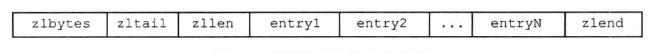

# redis

# 需要处理的问题：
    1. redis的数据类型以及对应的数据结构
    2. redis的主从、sentinel、cluster三种模式  实现的高可用二和高性能
    3. redis 的线程模型（或者说进程模型），网络I/O使用的时单线程模式
    4. bloom过滤器，缓存穿透，缓存击穿
    5. redis的扩容和缩容

# 1. redis 的底层基本数据结构
## 1. SDS simple dynamic string
### 1. 数据结构定义（64位）如下：
```c
struct __attribute__ ((__packed__)) sdshdr64 {
    uint64_t len; /* used */    // buf中使用了的长度
    uint64_t alloc; /* excluding the header and null terminator */ // buf分配的实际内存大小
    unsigned char flags; /* 3 lsb of type, 5 unused bits */ // 
    char buf[];  // 存放字符串的内容
};
```
### 2. 这个里面有一个内存预分配的小细节，就是下buf大小位1mb 以下的时候他的扩容会每次一倍+1B的空间，超过1MB就每次扩容就会多1MB+1B，多出来的1B是为了SDS的结束符
## 2. 链表
### 1. 数据结构定义如下：
```c
// 节点
typedef struct listNode {
    struct listNode *prev;
    struct listNode *next;
    void *value;
} listNode;
// 迭代器
typedef struct listIter {
    listNode *next;
    int direction;
} listIter;
// 链表实体
typedef struct list {
    listNode *head;
    listNode *tail;
    void *(*dup)(void *ptr);
    void (*free)(void *ptr);
    int (*match)(void *ptr, void *key);
    unsigned long len;
} list;
```
### 2. 说简单一点就是一个双向链表
## 3. 字典
### 1. 数据结构定义
```c 
// 字典节点， 能看出来这个使用了的是链表作为 下面dictht->table 的元素，说明 该字典使用的是数组加链表的方式来实现字典
typedef struct dictEntry {
    void *key;
    union {
        void *val;
        uint64_t u64;
        int64_t s64;
        double d;
    } v;
    struct dictEntry *next;
} dictEntry;
// 字典内容
typedef struct dictht {
   dictEntry **table;
   unsigned long size;
   unsigned long sizemask;
   unsigned long used;
} dictht;
// 字典
typedef struct dict {
   dictType *type;
   void *privdata;
   dictht ht[2];  // 为什么是两个： 因为0 是用来CRUD的，而1是用来扩容的时候操作的。
   long rehashidx; /* rehashing not in progress if rehashidx == -1 */ // 这个变量在rehash的时候很重要，如果它的值大于
   int16_t pauserehash; /* If >0 rehashing is paused (<0 indicates coding error) */
} dict;

// 迭代器
typedef struct dictIterator {
   dict *d;
   long index;
   int table, safe;
   dictEntry *entry, *nextEntry;
   /* unsafe iterator fingerprint for misuse detection. */
   long long fingerprint;
} dictIterator;
```
### 2. hash算法：   
            宏定义：#define dictHashKey(d, key) (d)->type->hashFunction(key)
### 3. 渐进式rehash
            就是他不是一次性将所有数据迁移，二十慢慢的将数据迁移，就是从原来的ht[0] 一个数组元素（存放的是一个链表），        
            当在rehashIndex迁移过程中遇到操作的时候，操作会先对ht[0] 进行操作，如果ht[0]操作失败在操作ht[1],      
            当ht[0]空了之后，ht[0]的指针会只想ht[1]，此时完成了rehash
## 4. 跳表
### 1. 数据结构定义***用来存储有序节点***
```c  
// 跳表节点定义，主要是用来存储有序节点
typedef struct zskiplistNode {
   sds ele;
   double score;
   struct zskiplistNode *backward;
   struct zskiplistLevel {
       struct zskiplistNode *forward;
       unsigned long span;
   } level[];
} zskiplistNode;
// 调表实体
typedef struct zskiplist {
    struct zskiplistNode *header, *tail;
    unsigned long length;
    int level;
} zskiplist;
/*
来自java中：ConcurrentSkipListMap的形象解释
    * Head nodes          Index nodes
    * +-+    right        +-+                      +-+
    * |2|---------------->| |--------------------->| |->null
    * +-+                 +-+                      +-+
    *  | down              |                        |
    *  v                   v                        v
    * +-+            +-+  +-+       +-+            +-+       +-+
    * |1|----------->| |->| |------>| |----------->| |------>| |->null
    * +-+            +-+  +-+       +-+            +-+       +-+
    *  v              |    |         |              |         |
    * Nodes  next     v    v         v              v         v
    * +-+  +-+  +-+  +-+  +-+  +-+  +-+  +-+  +-+  +-+  +-+  +-+
    * | |->|A|->|B|->|C|->|D|->|E|->|F|->|G|->|H|->|I|->|J|->|K|->null
    * +-+  +-+  +-+  +-+  +-+  +-+  +-+  +-+  +-+  +-+  +-+  +-+
   就是是在链表的基础上再在上层使用链表，并选取中间节点，我们看到的zskiplistNode->zskiplistLevel->span，就是选取中间节点的之间的间隙，
   再生成链表一个链表，
   以此往复知道节点数位自己想要的节点数为止
*/
```
## 5. 整数集合
### 1. 数据结构定义
```c 
typedef struct intset {
   uint32_t encoding;
   uint32_t length;
   int8_t contents[];
} intset;
```

## 6. 压缩列表   
### 1. 数据结构定义
```c 
/* Each entry in the ziplist is either a string or an integer. */
typedef struct {
    /* When string is used, it is provided with the length (slen). */
    // 如果是字符串则使用这个
    unsigned char *sval;
    // 如果是字符串，则slen就是字符串的长度
    unsigned int slen;
    /* When integer is used, 'sval' is NULL, and lval holds the value. */
    long long lval;
} ziplistEntry;
```      
### 2. 示意图如下
            
        3. 简单解释
## 7. 快表
### 1. 数据结构定义
```c 
// 快表节点 使用的是一个压缩列表作为一个节点
typedef struct quicklistNode {
   // 双向链表
   struct quicklistNode *prev;
   struct quicklistNode *next;

   unsigned char *zl;
   // 链表的字节数量
   unsigned int sz;             /* ziplist size in bytes */
   // 元素个数
   unsigned int count : 16;     /* count of items in ziplist */
   // LZF格式还是源格式
   unsigned int encoding : 2;   /* RAW==1 or LZF==2 */
   // 
   unsigned int container : 2;  /* NONE==1 or ZIPLIST==2 */
   // 节点是否压缩过
   unsigned int recompress : 1; /* was this node previous compressed? */
   // 
   unsigned int attempted_compress : 1; /* node can't compress; too small */
   // 格外的空间大小，剩余空间大小？
   unsigned int extra : 10; /* more bits to steal for future usage */
} quicklistNode;
// 快表的ZLF压缩算法  
// https://www.cnblogs.com/en-heng/p/6283282.html
// 一个介绍ZLF原理的博文
typedef struct quicklistLZF {
   unsigned int sz; /* LZF size in bytes*/
   char compressed[];
} quicklistLZF;
typedef struct quicklistBookmark {
   quicklistNode *node;
   char *name;
} quicklistBookmark;
// 快表实体
typedef struct quicklist {
   quicklistNode *head;
   quicklistNode *tail;
   unsigned long count;        /* total count of all entries in all ziplists */
   unsigned long len;          /* number of quicklistNodes */
   int fill : QL_FILL_BITS;              /* fill factor for individual nodes */
   unsigned int compress : QL_COMP_BITS; /* depth of end nodes not to compress;0=off */
   unsigned int bookmark_count: QL_BM_BITS;
   quicklistBookmark bookmarks[];
} quicklist;
// 迭代器           
typedef struct quicklistIter {
   const quicklist *quicklist;
   quicklistNode *current;
   unsigned char *zi;
   long offset; /* offset in current ziplist */
   int direction;
} quicklistIter;
// 
typedef struct quicklistEntry {
   const quicklist *quicklist;
   quicklistNode *node;
   unsigned char *zi;
   unsigned char *value;
   long long longval;
   unsigned int sz;
   int offset;
} quicklistEntry;

```
            简单来说都是每个压缩列表使用一个双向链表来连接
# 2. redis对象
## 1. redisObject基本结构
```c 
    typedef struct redisObject {
        unsigned type:4;
        unsigned encoding:4;
        unsigned lru:LRU_BITS; /* LRU time (relative to global lru_clock) or
                                * LFU data (least significant 8 bits frequency
                                * and most significant 16 bits access time). */
        int refcount;
        void *ptr;
    } robj;
```


        
        
        
